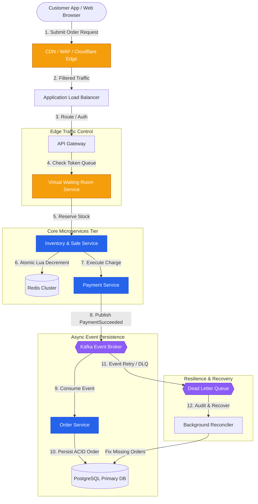
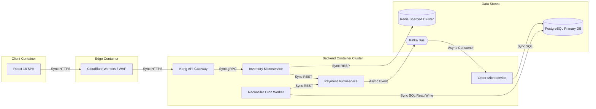
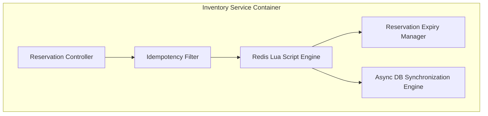
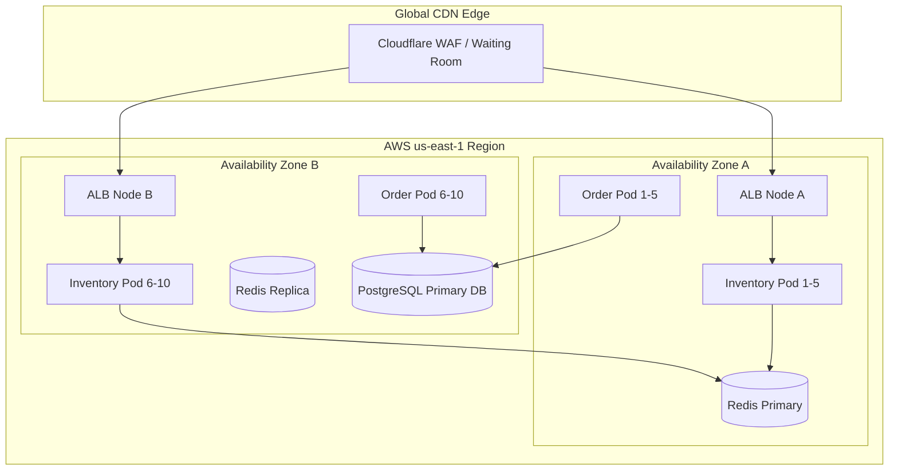

# SALESTORM - 02 High-Level Architecture (HLD)

## 1. Complete End-to-End Request Path
When 10,000 to 500,000 customers hit "Buy Now" simultaneously, requests traverse a layered architecture designed to protect origin databases while executing sub-millisecond stock reservations.

```
Customer App / Web
       │
       ▼ [1. HTTPS POST /reserve]
  CDN / WAF / Cloudflare Edge ────► [Throttling Point 1: Edge Virtual Waiting Room]
       │
       ▼ [2. Passed Token Traffic]
  Application Load Balancer (ALB)
       │
       ▼ [3. Route & Rate Limit]
  API Gateway (Kong / Envoy) ─────► [Throttling Point 2: Token Bucket & Bot Filter]
       │
       ▼ [4. gRPC / REST]
  Inventory & Sale Service ───────► [EXACT CONCENTION POINT: Atomic Redis Lua Script]
       │                                  │
       ▼ [5. Authorize Payment]           ▼ (Postgres Async Sync)
  Payment Service ───────────────► Primary PostgreSQL DB (Source of Truth)
       │
       ▼ [6. Emit PaymentSucceeded]
  Kafka Event Bus ────────────────► [Queueing Point: Distributed Message Buffer]
       │
       ▼ [7. Consume Event]
  Order Service ──────────────────► [Persist Order & Line Items]
       │
       ├──► Shipment Service
       └──► Notification Service

 [Background Reconciler Worker] ──► Audit Kafka DLQ & Unfulfilled Paid Reservations
```

---

## 2. System Context Diagram (C4 Level 1)



---

## 3. Container Diagram (C4 Level 2)



---

## 4. Component Diagram (C4 Level 3 - Inventory & Sale Service)



---

## 5. Deployment Topology Diagram



---

## 6. Traffic Control & Contention Management

### Traffic Throttling, Queueing, and Rejection Points

1. **Edge Virtual Waiting Room (Throttling Point 1)**:
   - **Mechanism**: Token Bucket algorithm running on Cloudflare Workers at the CDN edge.
   - **Behavior at 500,000 req/s**: Admits max 2,000 requests/sec to origin servers; excess 498,000 users wait in browser queue with polling heartbeat.
   - **Rejection**: HTTP 429 Too Many Requests with `Retry-After: 5`.

2. **API Gateway Rate Limiter (Throttling Point 2)**:
   - **Mechanism**: IP-based sliding window rate limiter and JWT authentication signature filter.
   - **Rejection**: HTTP 401 Unauthorized or HTTP 429 for burst bots.

3. **In-Memory Contention Control (Exact Contention Point)**:
   - **Mechanism**: Single-threaded atomic Redis Lua script (`DECR` with boundary check).
   - **Behavior**: Executes 100 stock decrements in ~10 ms; all subsequent 9,900 requests immediately receive `SOLD_OUT` response in < 3 ms.
   - **Source of Truth**: PostgreSQL database updated asynchronously via versioned background writes (`UPDATE inventory SET available_quantity = X WHERE version = Y`).

4. **Kafka Message Broker (Queueing Point)**:
   - **Mechanism**: Multi-partition event queue buffering `PaymentSucceededEvent` messages during downstream Order Service outages.
   - **Durability**: Messages persisted to disk with 7-day retention.
