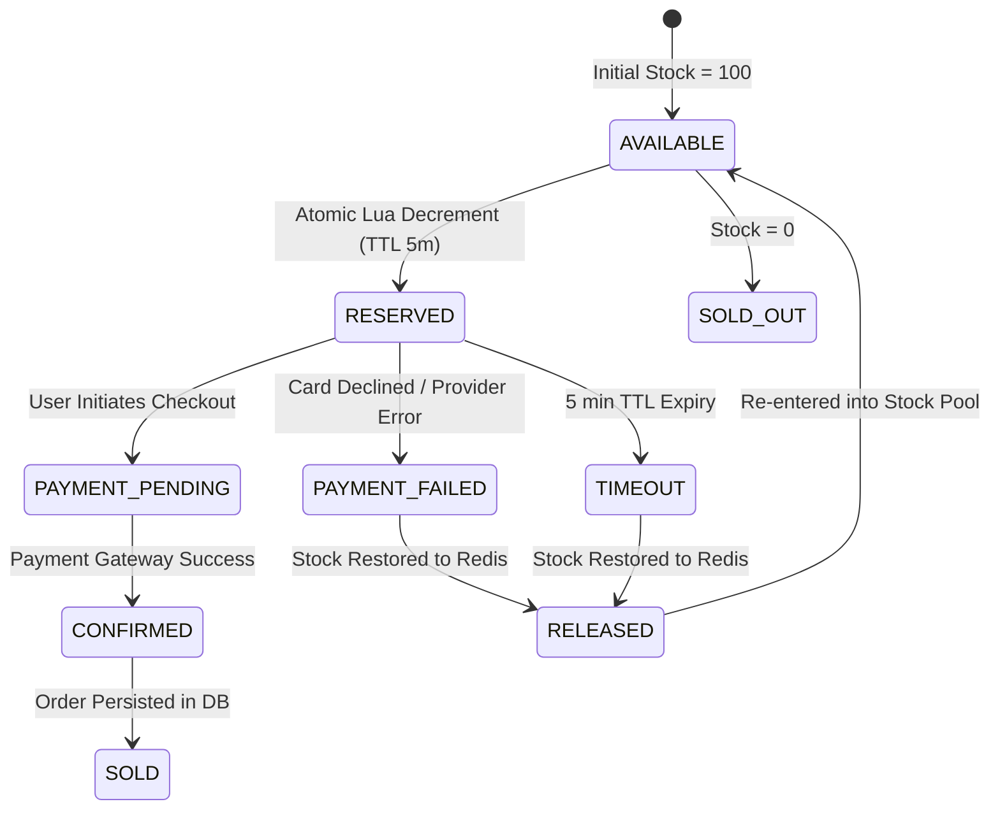
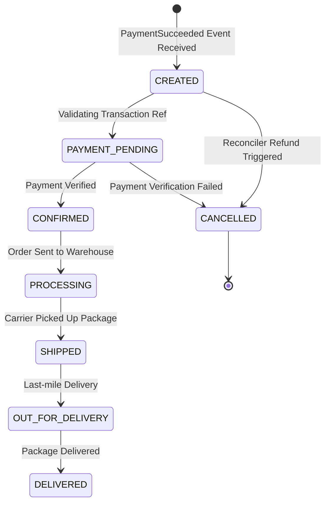
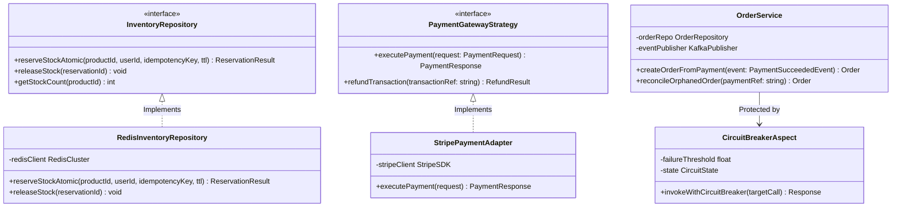
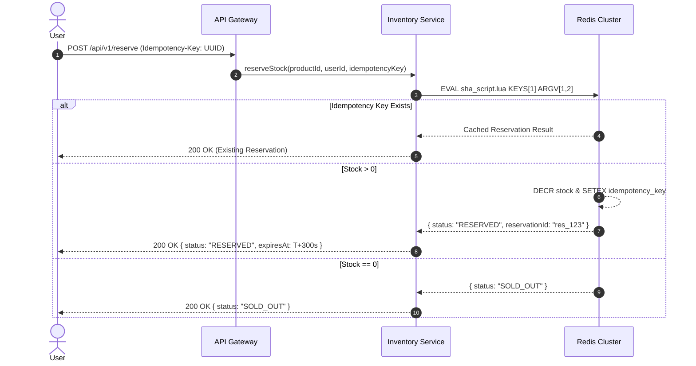
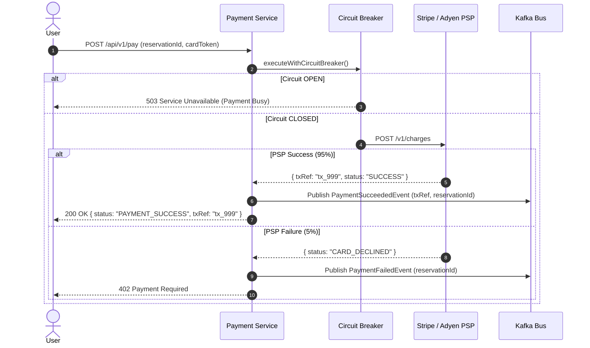
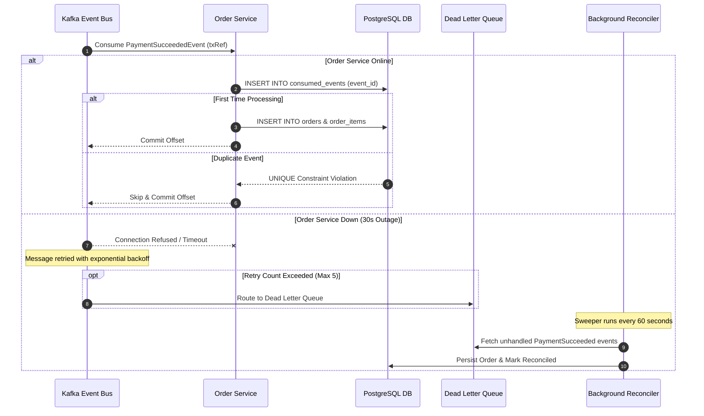

# SALESTORM - 03 Low-Level Design (LLD) & State Machines

## 1. Concurrency Model Evaluation & Selection Rationale

| Concurrency Approach | Mechanism | Max Throughput | DB Lock Risk | Selection Decision & Rationale |
|---|---|---|---|---|
| **Pessimistic Locking** | `SELECT ... FOR UPDATE` on DB row | ~200 req/sec | **EXTREME**. Deadlocks and thread pool exhaustion when 10k users hit DB simultaneously. | **REJECTED**: Severe lock contention crashes relational database under flash load. |
| **Optimistic Locking** | `UPDATE ... WHERE version = N` | ~1,500 req/sec | **HIGH RETRY COST**. 99% of requests fail version check and thraash CPU retrying. | **REJECTED**: High abort rate under 100-to-10,000 contention ratio. |
| **Atomic Redis Lua Decrement** | Single-threaded in-memory atomic Lua execution | **80,000+ req/sec** | **ZERO DB LOCKS**. In-memory atomic decrement completes in < 1 ms with zero lock contention. | **SELECTED**: Primary reservation engine guaranteeing zero overselling at microsecond speed. |

---

## 2. Inventory State Machine & Failure Transitions

---

## 3. Order Lifecycle State Machine & Outage Recovery

---

## 4. Low-Level Class Diagram (Modules, Interfaces & Boundaries)

---

## 5. Sequence Diagram 1: Purchase & Stock Reservation

---

## 6. Sequence Diagram 2: Payment Execution & Event Emission

---

## 7. Sequence Diagram 3: Async Order Creation & Outage Recovery

---

## 8. Failure Scenario Resilience Matrix

| Failure Scenario | Root Cause | System Resilience Action | Recovery Outcome |
|---|---|---|---|
| **Payment Declined (5%)** | Card expired / Insufficient funds | `PaymentFailedEvent` emitted -> Redis stock incremented by 1. | Stock returned to pool; next waiting user purchases unit. |
| **Payment Timeout** | Gateway network drop | 5-minute reservation TTL expires -> Redis key expiry hook triggers release. | Stock returned to available pool. |
| **Duplicate Payment Submit** | Client double-click | `UNIQUE (transaction_ref)` & `idempotency_key` constraint check. | Second call returns cached payment response with zero double-charge. |
| **Order Service Outage (30s)** | Database failover / service restart | Kafka buffers events -> Retries with backoff -> DLQ -> Reconciler worker sweep. | 100% of paid reservations converge to confirmed orders in DB. |
