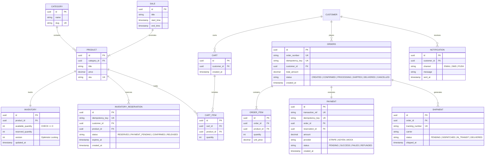

# SALESTORM - 04 Database ER Schema Specification

## 1. Entity-Relationship (ER) Diagram

---

## 2. Integrity Constraints & Indexing Strategy

| Table Name | Constraint / Index Name | Constraint Type | Purpose & Impact |
|---|---|---|---|
| `INVENTORY` | `chk_inventory_available_qty` | `CHECK (available_quantity >= 0)` | DB-level absolute barrier preventing negative inventory. |
| `INVENTORY` | `idx_inventory_product_ver` | `COMPOSITE INDEX (product_id, version)` | Microsecond lookups during background PostgreSQL stock synchronization. |
| `INVENTORY_RESERVATION` | `uk_reservation_idempotency` | `UNIQUE (idempotency_key)` | Blocks duplicate user clicks from creating multiple reservations. |
| `INVENTORY_RESERVATION` | `idx_reservation_expiry` | `INDEX (status, expires_at)` | Accelerates background sweeper finding expired reservations. |
| `ORDERS` | `uk_orders_idempotency` | `UNIQUE (idempotency_key)` | Prevents duplicate order creation during event retry storms. |
| `PAYMENT` | `uk_payment_tx_ref` | `UNIQUE (transaction_ref)` | Eliminates double-charging risks from webhooks. |
